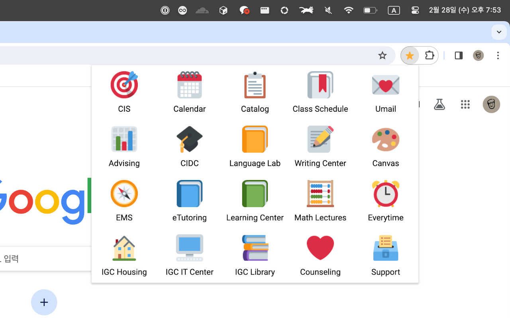
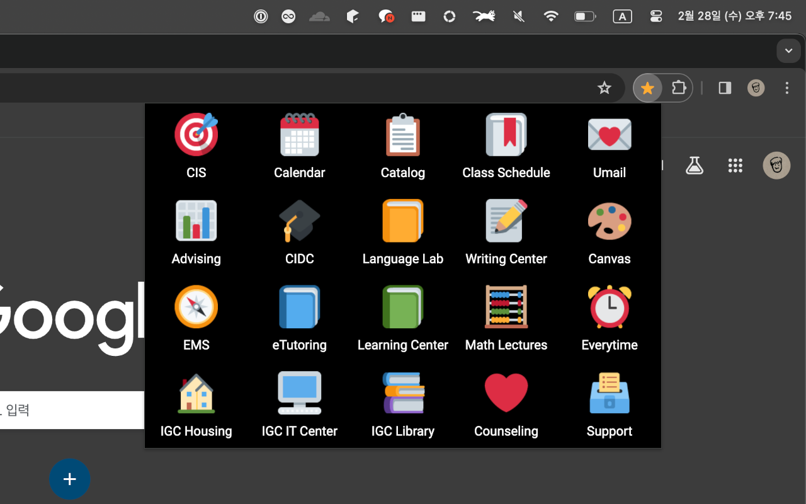

# Quick Utah

Chrome extension that provides quick access to websites related to University of Utah Asia Campus

Inspired by [Quick Sook](https://github.com/seohyun0120/Quick-Sook)

## Preview

## Installation

### Chrome Web Store

### Manual Installation

1. Download and unzip [Quick Utah](https://github.com/yehwankim23/quick-utah/releases/latest/download/quick-utah.zip)
2. Go to Chrome Extensions tab (`chrome://extensions`) and enable `Developer mode`
3. Click `Load unpacked` and select the unzipped folder
